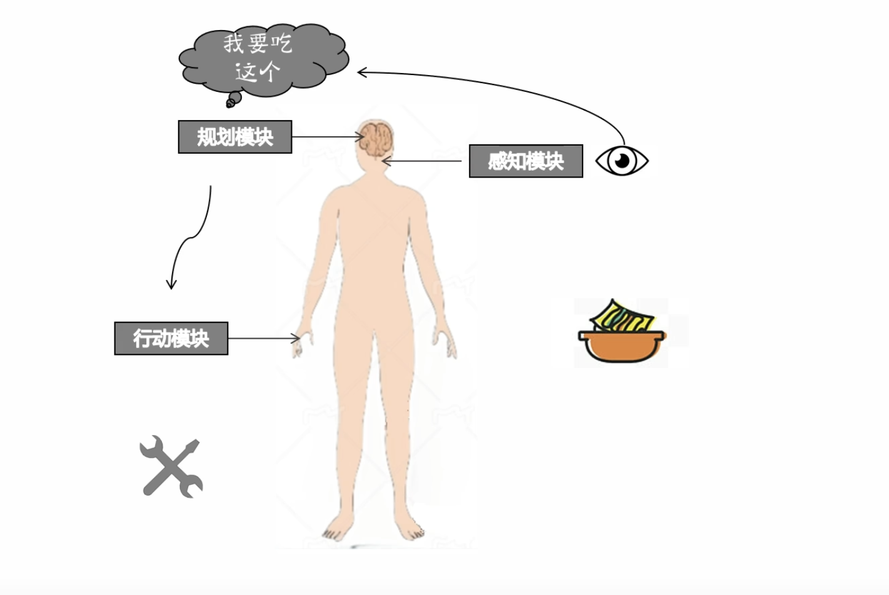
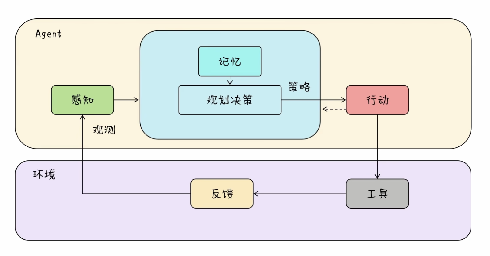
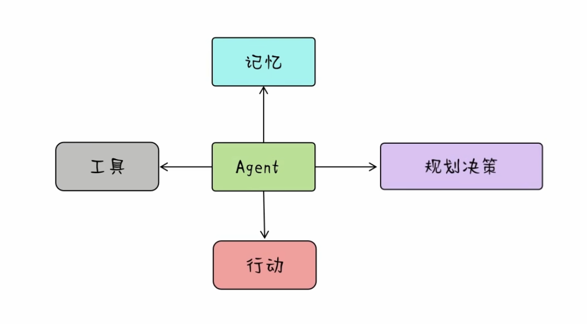
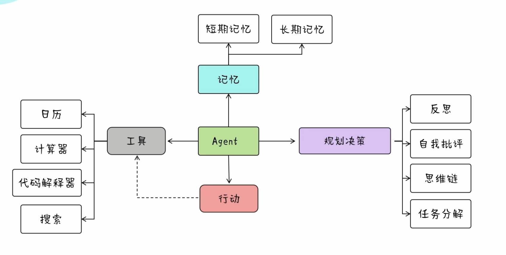

# Agent通俗理解
**什么是Agent**
AI Agent智能体，是指一种能够模拟人类思考和行为来自动执行任务，以解决复杂问题的程序或系统。

**人类思考和行为(以人看吃播吃美食的过程为例)**

**人类思考和行为的抽象**

**人类思考和行为的抽象(忽略掉环境和感知模块)--->Agent架构图**

忽略掉环境和感知模块后，上面的图就是OpenAi 的安全架构师在X上分享的一个Agent的架构图。

**Agent架构**

短期记忆来自上下文学习，长期记忆需要借助外部存储
